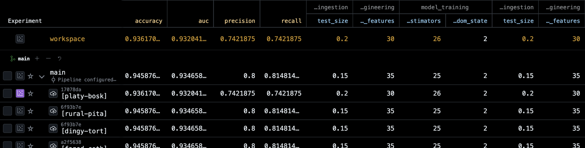

## **Spam Classification: An End-to-End MLOps Pipeline** 📧

This project implements an end-to-end machine learning pipeline for spam classification, built with a focus on reproducibility and experiment tracking. Leveraging DVC for data versioning and pipeline orchestration, and DVC Live to seamlessly track and compare experiments, to ensure a systematic approach in developing and evaluating model performance. From raw data ingestion to final model metrics, every step is version-controlled and easily reproducible.

***

### 🛠️ **Project Highlights**

* **End-to-End Pipeline**: A fully automated workflow for spam classification, showcasing a complete ML lifecycle.
* **MLOps & Reproducibility**: Leverages **DVC** and **DVCLive** for data and experiment versioning, ensuring every model run is traceable and reproducible.
* **Performance-Driven Approach**: Explores and compares multiple models to select the best performer based on key metrics.

***

### 🧠 **Machine Learning Workflow**

1.  **Data Preprocessing**: Initial data cleaning, including duplicate removal (403 duplicates) and text normalization (lowercase, digit, and special character removal).
2.  **Feature Engineering**: Transformed raw text into a numerical format using **TF-IDF vectorization** after applying **Porter Stemming** and removing stopwords.
3.  **Model Training**: Trained and evaluated four different models (**Logistic Regression**, **Decision Tree**, **AdaBoost**, **Random Forest**) to find the optimal solution.

***

### 📊 **Key Results**

The **Random Forest Classifier** was selected as the final model due to its exceptional performance, particularly its high precision.

| Model | Accuracy | Precision |
| :--- | :---: | :---: |
| Logistic Regression | 0.9749 | 0.9412 |
| AdaBoost Classifier | 0.9603 | 0.8814 |
| **Random Forest Classifier** | **0.9845** | **0.9915** |

The **0.9915 precision score** is a critical metric for this task, as it indicates the model is highly reliable in identifying spam messages while minimizing false positives.

***

### 📈 **Experiment Tracking & Visualization**

To ensure reproducibility and enable easy comparison of different models and hyperparameters, this project uses **DVCLive** for automated experiment tracking. All key metrics (accuracy, precision, recall) and parameters are logged and can be viewed directly within the DVC extension for VS Code.

A history of experiment runs, allowing for quick analysis of model performance and showcasing robust tracking capabilities.

### ⚙️ **Tech Stack**

* **Core ML**: `scikit-learn`, `pandas`, `numpy`
* **Text Processing**: `NLTK`, `re`
* **MLOps**: **DVC**, **DVCLive**

***

### ▶️ **How to Run**

1.  **Clone the repo:** `git clone <repository-url>`
2.  **Install dependencies:** `pip install -r requirements.txt`
3.  **Execute the pipeline:** `dvc repro`
    *This command will automatically run all pipeline stages, from data ingestion to model evaluation.*

***

### 🙏 **Acknowledgements**

A special thanks to my instructor, **Vikash Das**, for their guidance and teachings. Their help in understanding end-to-end ML pipelines was crucial in making this project.